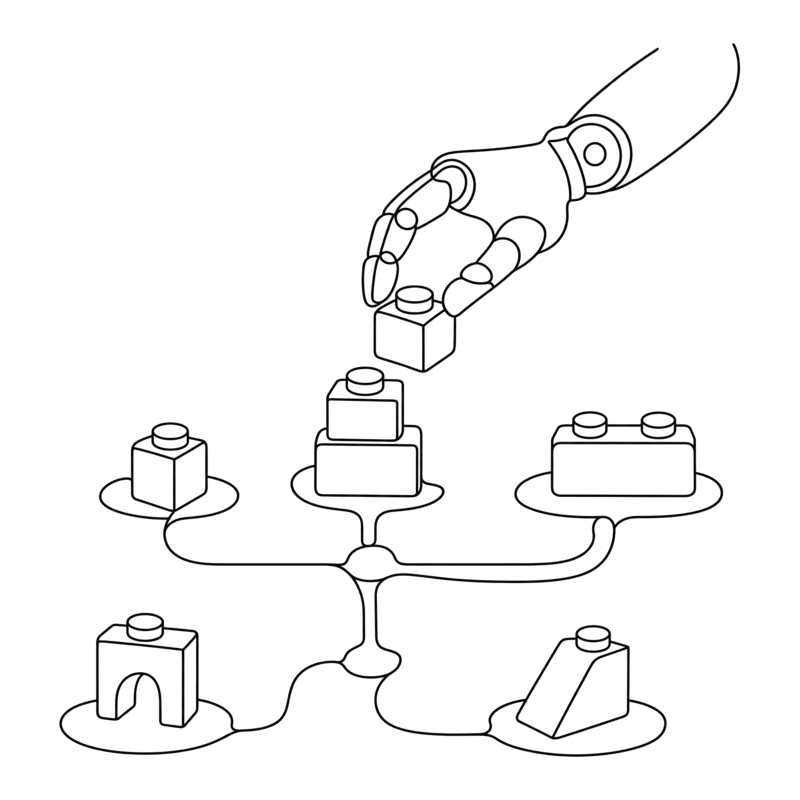
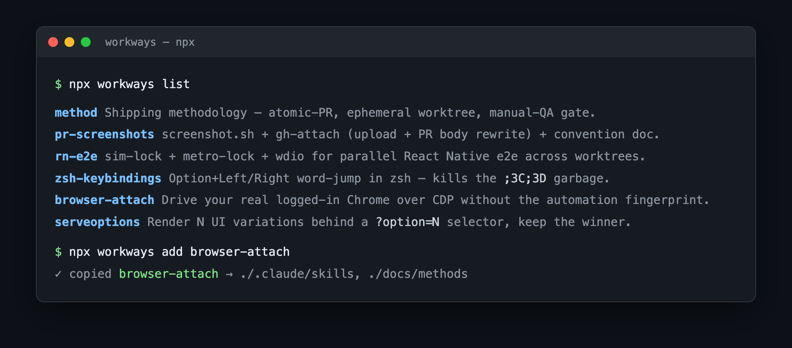

<table border="0" cellspacing="0" cellpadding="0">
<tr>
<td width="220" valign="middle">
<picture>
<source media="(prefers-color-scheme: dark)" srcset="docs/assets/logo-dark.png">

</picture>
</td>
<td valign="middle"><h1>W&nbsp;O&nbsp;R&nbsp;K&nbsp;W&nbsp;A&nbsp;Y&nbsp;S</h1></td>
</tr>
</table>

**Agentic workflows, skills, and methods for AI coding agents.** Battle-tested patterns pulled out of real Claude Code projects and packaged so you can drop them into your own. Most clusters ship a ready-to-use `.claude/` skill or a `CLAUDE.md`-linkable method, so your agent picks up the capability the moment it lands: drive a real logged-in browser, run parallel e2e suites, attach screenshots to PRs, see UI options side by side.

Distributed as a scaffolder, not a runtime dependency: `npx workways add <cluster>` copies the files into your repo so you own and edit them, instead of depending on `workways` at runtime.

## Demo



## Quickstart

```bash
npx workways list                  # see available clusters
npx workways add pr-screenshots    # copy one cluster into cwd
npx workways add --all             # copy everything
```

Flags: `--dest <dir>`, `--force`, `--dry-run`.

## Clusters

### `method`
Shipping methodology: atomic-PR, ephemeral worktree, manual-QA gate, PR-screenshot rule. Drops a `docs/methods/` Markdown bundle you can adapt and link from your `CLAUDE.md` / `CONTRIBUTING.md`.

### `pr-screenshots`
End-to-end pipeline for embedding screenshots/videos in **private-repo** PR descriptions:
- `scripts/screenshot.sh` — iOS-sim screenshot helper, names by branch + route
- `scripts/gh-attach/` — Playwright wrapper that borrows your Chrome session, uploads to `github.com/user-attachments`, and rewrites the PR body in place
- `docs/methods/pr-screenshots.md` — the convention

### `rn-e2e`
Full parallel-Appium-on-iOS toolkit for React Native / Expo apps — run multiple e2e suites concurrently from separate worktrees without sim, Metro, or DerivedData collisions:
- `scripts/sim-lock/` — auto-discovers a free iOS sim from a candidate list, boots it, holds a UDID-keyed lock; exports `IOS_UDID` / `IOS_DEVICE_NAME`
- `scripts/metro-lock/` — allocates a free Metro port from a range, holds a port-keyed lock; `with-derived-data.sh` redirects Xcode `DerivedData` into a per-worktree dir so parallel `expo run:ios` builds don't corrupt each other
- `scripts/e2e/run-with-metro.sh` — spawns `expo start` on the locked port, waits for `/status`, runs wdio, tears Metro down on exit (`E2E_METRO_EXTERNAL=1` to skip)
- `e2e/` — wdio + Mocha harness with per-spec webm recording (`startRecordingScreen` → ffmpeg → `e2e/recordings/`), native-build and Expo-Go wdio configs, accessibility-id selector helpers, and a `version-footer` spec that asserts build-mode-aware version strings
- `docs/methods/parallel-appium.md` — composition diagram, the Metro-port-baked-into-`.app` gotcha (and the `buildReactNativeFromSource: true` workaround), and conventions for reserving a sim for manual QA
- `docs/proof/PARALLEL-VALIDATION.md` — captured evidence from cumbreTrial #82/#87: two worktrees, two sims, two Metros, `login-invalid` green on both concurrently with `lsof` showing each app on its own bundler port

### `browser-attach`
Drive the user's **real, logged-in Chrome** over CDP instead of letting an
automation MCP spawn its own flagged browser. The automation fingerprint
(`navigator.webdriver` + the "controlled by automated test software" banner)
comes from the `--enable-automation` launch switch, not the CDP connection — so
attaching to a human-launched Chrome looks like an ordinary browser. Ships a
Claude skill with **lazy-loaded per-site subskills**:
- `.claude/skills/browser-attach/SKILL.md` — the attach setup (debug port +
  non-default profile for Chrome 136+, `--browserUrl` MCP arg, restart) and the
  scrape-with-`evaluate_script` working pattern
- `.claude/skills/browser-attach/sites/ebay.md` — Akamai `/sch` "Access Denied"
  and the search-from-homepage workaround; result selectors; query params
- `.claude/skills/browser-attach/sites/facebook.md` — Marketplace login,
  location-scoped URLs, "Partner listing" ≠ local, scroll-to-load, obfuscated-
  class scraping
- `.claude/skills/browser-attach/sites/_new-site.md` — stub for the next site
- `docs/methods/browser-attach.md` — the method, including what it does/doesn't
  defeat (beats the flag; not Akamai/Cloudflare/Turnstile or Google sign-in)

### `zsh-keybindings`
Fix Option+Left / Option+Right in zsh so they jump word-by-word (matching Claude Code, browsers, and every native macOS text field). Without this you get garbage like `;3C;3D` in your prompt.
- `shell/option-arrow.zsh` — drop-in `bindkey` rules; `source` from `~/.zshrc`
- `docs/methods/zsh-keybindings.md` — explainer with debugging tips for non-standard terminals

### `serveoptions`
Make a visual/UX decision by *seeing* it. Generates N meaningfully-distinct variations of a UI feature, drops a floating dev-only selector pill that cycles them via a `?option=N` URL param, and serves locally so you pick the winner in the browser. After you choose, the selector and losing options are stripped, leaving only the chosen implementation.
- `.claude/skills/serveoptions/SKILL.md` — the workflow (build options → wire selector → serve → keep the winner)

### `godot`
Verify a Godot 4.x change by *seeing* it, plus the co-op + dedicated-server lessons that cost real debugging time. Godot's `--headless` mode runs a dummy `DisplayServer` (no window) but still renders internally, so you can capture the viewport to a PNG from a headless boot, on CI, a VM, or a remote shell where an OS screen-grab is blocked.
- `.claude/skills/godot-shots/SKILL.md` — the agent workflow and the capture pattern that actually produces a clean frame (settle N process frames so GI/fog/shadows finish, `await RenderingServer.frame_post_draw`, then `get_viewport().get_texture().get_image().save_png()`)
- `scripts/godot-shot/dev_shots.gd` — drop-in autoload: parses `--shot <name>`, runs your registered scene setup, captures, quits
- `scripts/godot-shot/godot-shot.sh` / `.ps1` — wrapper that finds the Godot binary, rebuilds the class-name cache (`--import`, else a fresh checkout dies with "Identifier not declared"), runs the shot, and copies PNGs to `./shots/`
- `docs/methods/godot-coop.md` — the gotchas: bump `PROTOCOL_VERSION` when the `@rpc` surface on an always-present node changes (the checksum-mismatch trap), `set_multiplayer_authority` after `add_child`, `call_local` reliable RPCs for shared state, headless still needs `libX11`/`libGL` linked, mount a volume for `user://`, `HeightMapShape3D` over `ConcavePolygonShape3D` for terrain, MultiMesh-batch repeated props

## Philosophy

Scaffold, don't depend. Half of this is bash + Markdown — that has to live in your repo anyway. The Node/Playwright pieces you'll want to customize. Owning the files makes both natural.

## License

MIT
